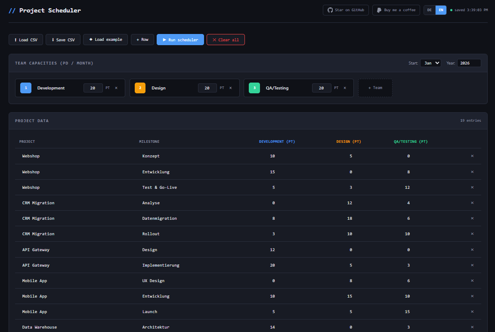
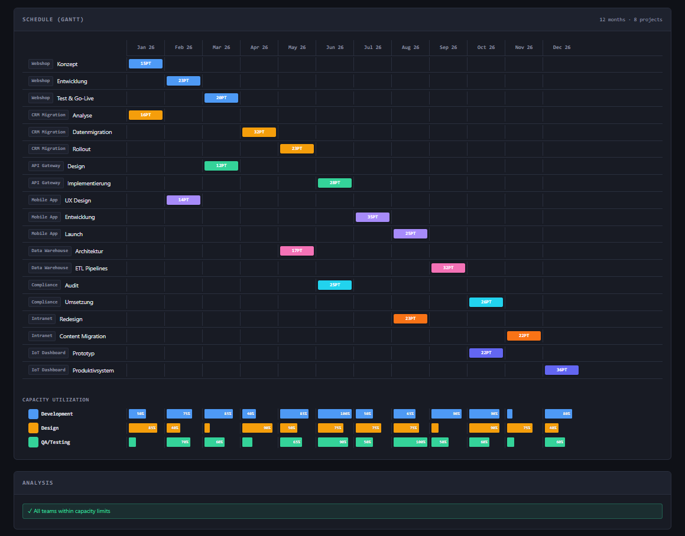

# // Project Scheduler

**A capacity-constrained multi-project milestone scheduler that runs entirely in your browser.**

No server, no signup, no dependencies — just open the HTML file and start planning.

Link: [https://mindactuate.github.io/multi-project-milestone-calculator/](https://mindactuate.github.io/multi-project-milestone-calculator/)





---

## What it does

You have **multiple projects**, each with **milestones**, and **several teams** that contribute effort (in person-days) to each milestone. The scheduler simulates **month-by-month execution**, where teams work off their effort over multiple months, respecting:

- **Team capacity limits** — each team has a monthly budget in person-days
- **Multi-month milestones** — if a milestone needs 50 PD from a team with 20 PD/month, it takes 3 months
- **Per-milestone dependencies** — each milestone can be marked as 🔒 (must wait for predecessor to fully complete) or 🔓 (team can start once it individually finishes the predecessor)
- **Two scheduling strategies** — maximize parallelization across projects, or prioritize completing high-priority projects first

The result is a **Gantt chart** with multi-month bars, a **capacity utilization heatmap**, and automatic **overload warnings** and **project completion dates**.

---

## Features

### Core Scheduling
- **Multi-month simulation** — teams work off effort over time, not "one milestone = one month"
- **Two scheduling strategies:** Max. Parallelization and Max. Speed/Priority
- **Per-milestone dependency control** — 🔒/🔓 toggle per milestone row
- One-click strategy toggle with automatic re-scheduling
- Configurable start month and year
- Up to 48 months planning horizon

### Dynamic Teams
- Add and remove teams freely (no fixed limit)
- Custom team names and per-team monthly capacity (in person-days)
- Click the color badge to cycle through 15 colors
- At least one team is always required

### Data Management
- **CSV Import** — load your project data from a CSV file (`;` or `,` separated, auto-detected)
- **CSV Export** — save the plan including scheduled months back to CSV
- **Auto-save** — state is saved to `localStorage` every 5 seconds
- **Example data** — one-click load of 8 sample projects with 19 milestones
- Inline editing of all fields directly in the table

### Visualization
- **Gantt Chart** — multi-month color-coded bars per project, showing total effort and duration
- **Capacity Heatmap** — per-team utilization bars for each month (green = ok, red = overloaded)
- **Analysis Panel** — capacity warnings, plus project completion dates

### Internationalization
- Full **German (DE)** and **English (EN)** UI
- One-click language toggle in the header
- All labels, buttons, tooltips, warnings, CSV headers, and toasts are translated
- Language preference is persisted

### Privacy & Legal
- **100% client-side** — all data stays in your browser's `localStorage`
- No server, no cookies, no tracking, no analytics
- **No external resources** — no Google Fonts, no CDN calls, no tracking pixels
- System fonts only (SF Mono, Segoe UI, etc.) — zero network requests beyond the HTML itself
- Built-in **Impressum** (Legal Notice) and **Datenschutzerklärung** (Privacy Policy) modals with placeholder templates ready for your details — required for DSGVO/GDPR compliance when hosting in Germany

---

## Getting Started

### Option 1: Just open it
1. Download `index.html`
2. Open it in any modern browser
3. Done.

### Option 2: Use the hosted version
Visit the GitHub Pages deployment (if enabled) or open the raw HTML file directly.

---

## CSV Format

The CSV uses `;` as separator (`,` is also auto-detected). The first row contains headers:

```
Project;Milestone;Development (PT);Design (PT);QA/Testing (PT)
Webshop;Concept;10;5;0
Webshop;Development;15;0;8
Webshop;Test & Go-Live;5;3;12
```

**Import behavior:**
- Team columns are auto-detected from headers (everything after Project and Milestone that ends in `(PT)` or `(PD)`)
- Team names are extracted from the headers (stripping the unit suffix)
- Existing teams are replaced by the teams found in the CSV

**Export adds** `Start` and `End` columns with the scheduled months if scheduling has been run.

---

## How the Algorithm Works

The scheduler runs a **month-by-month simulation**. Each month, every team distributes its available capacity across eligible milestones.

### Per-Milestone Dependencies (🔒/🔓)

Each milestone (except the first in a project) has a dependency toggle:

- **🔓 Overlap allowed** (default) — a team can start working on this milestone as soon as *it* finishes the previous one, even if other teams are still working on that predecessor
- **🔒 Strict wait** — this milestone can only begin once *all* teams have fully completed the previous milestone

Example: "Test & Go-Live" should be 🔒 (can't test until development is done), but "Documentation" could be 🔓 (writing team can start while development continues).

### ⇉ Max. Parallelization

Each team distributes its monthly capacity **proportionally** across all eligible milestones from all projects. This means all projects progress simultaneously.

### ⚡ Max. Speed (Priority)

Each team puts **all capacity into the highest-priority eligible milestone** first. Only if there's leftover capacity does it spill to the next. Projects higher in the table have higher priority.

### Common rules

- Teams work off their effort over multiple months (e.g., 50 PD at 20 PD/month = 3 months)
- A milestone is complete only when ALL teams have finished their portion
- Both strategies are greedy heuristics — they work well for typical portfolios

---

## Tech Stack

- **Zero dependencies** — single HTML file, vanilla JavaScript, CSS
- **System fonts** — no external font loading (DSGVO-compliant, no Google Fonts CDN)
- **No build step** — no npm, no bundler, no framework
- **No external requests** — the HTML file is completely self-contained
- Tested in Chrome, Firefox, Safari, Edge

---

## Contributing

1. Fork the repo
2. Edit `index.html`
3. Open a Pull Request

Since it's a single file, there's no build process — just edit and test in the browser.

---

## Support

If you find this tool useful:

- ⭐ [Star this repo](https://github.com/mindactuate/multi-project-milestone-calculator)
- ☕ [Buy me a coffee](https://paypal.me/mindactuate)

---

## License

GPLv3 — see [LICENSE](LICENSE) for details.
